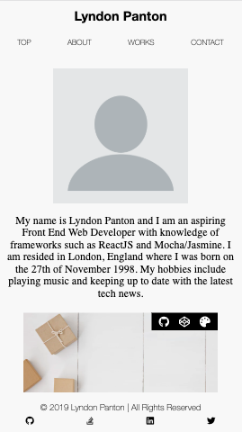
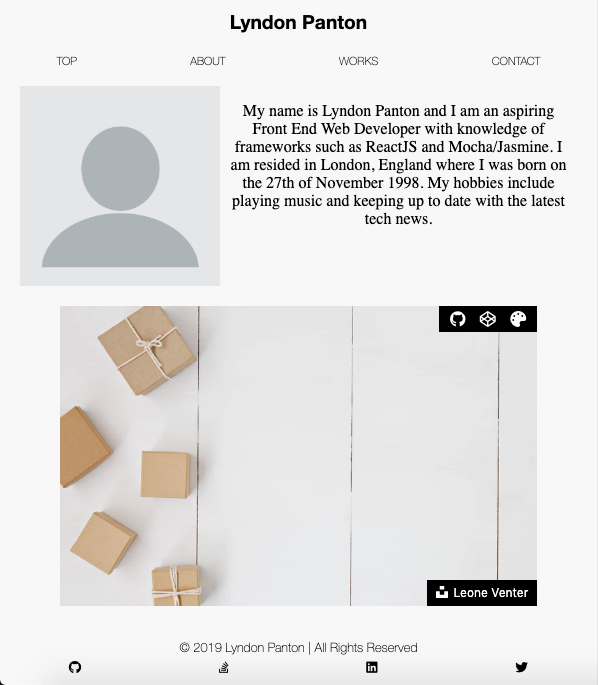
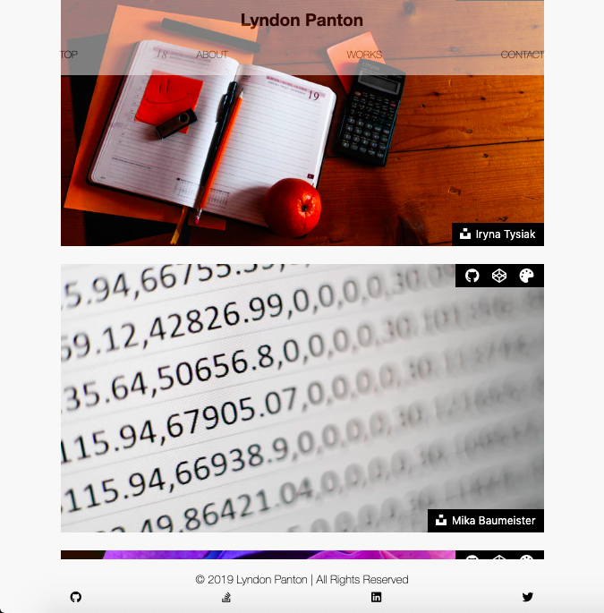
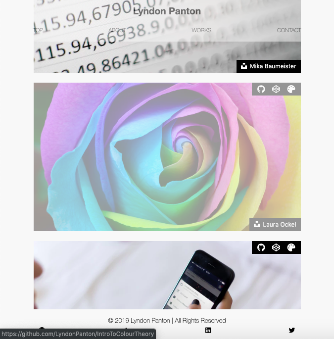
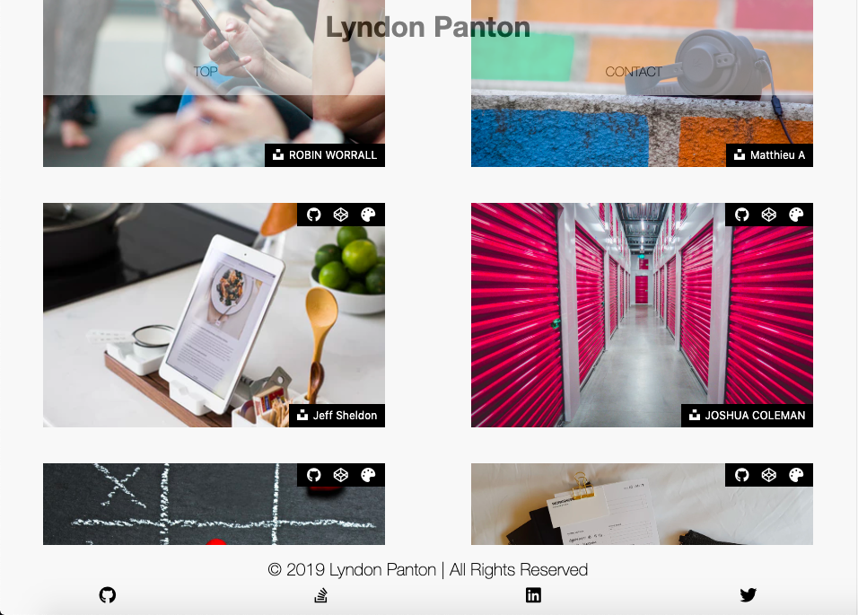
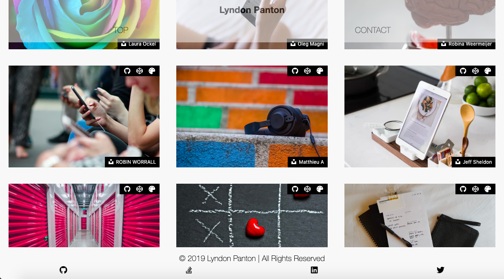
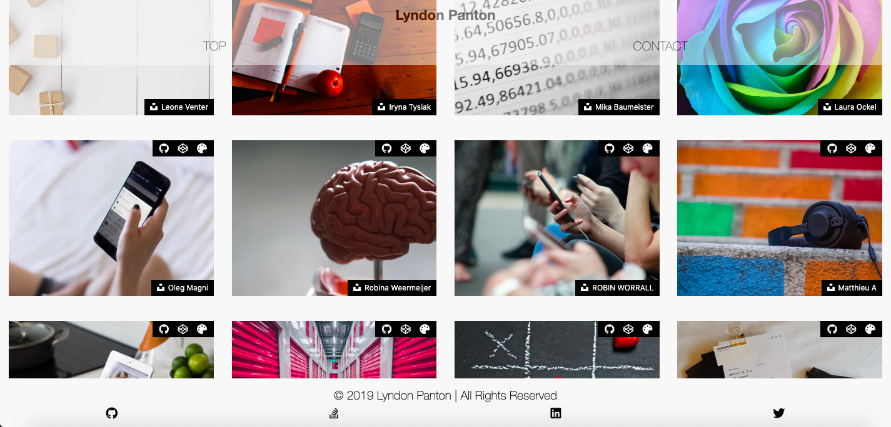
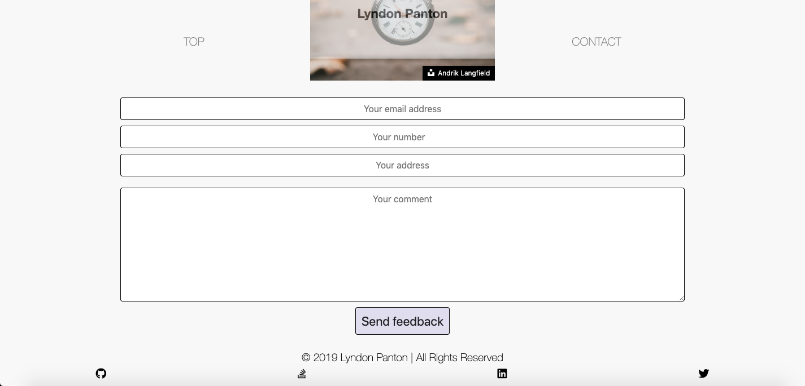

# Portfolio

## How To Open
> 1. Go to the project's download folder
> 2. Right click on the file named _index.html_
> 3. Click on the _open with_ option
> 4. Open the file in your desired browser

## How To Use
> 1. Click on icons to navigate to projects, my social media, credits, etc.

## Requirements
> 1. This project requires a browser to run
> 2. The browser should have Javascript available and enabled for optimal use

## Extra Information
> 1. This is a project features highlights of my web development works

## Preview

